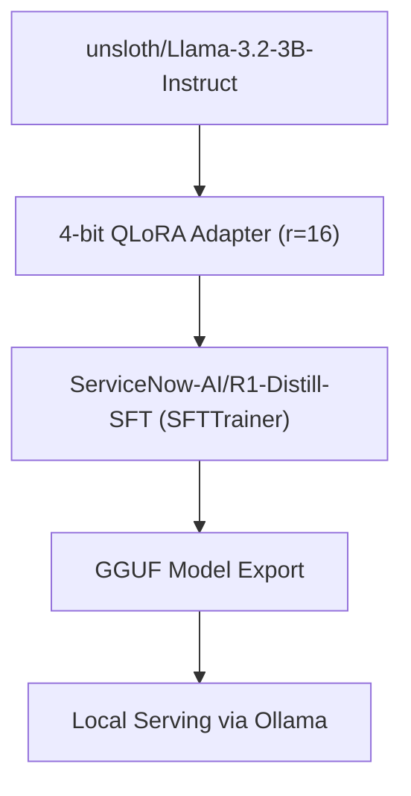

# 🦙 Fine-Tuning Llama-3.2-3B into a Reasoning Assistant

[](./)
[](https://github.com/unslothai/unsloth)
[](LICENSE)

An end-to-end implementation for fine-tuning **Llama-3.2-3B-Instruct** using **Unsloth 4-bit QLoRA** and **TRL's `SFTTrainer`**. This project fine-tunes the base model on synthetic stream-of-consciousness datasets to output structured reasoning steps (`<thinking>`) prior to producing final answers. The fine-tuned model is then exported to **GGUF** format and served locally using **Ollama**.

---

## 📌 Project Features

- **Efficient Fine-Tuning:** Uses 4-bit Quantized Low-Rank Adaptation (QLoRA) with Unsloth kernels to keep memory usage under 8GB VRAM (runs on free Kaggle T4/P100 or Colab GPUs).
- **Supervised Fine-Tuning Pipeline:** Powered by TRL's `SFTTrainer` to automate prompt formatting, dataset packing, and batch tokenization.
- **Reasoning Structure:** Trains the model to wrap reasoning processes inside `<thinking>` and `<solution>` XML blocks.
- **Export Formats:** Saves native PyTorch safetensors as well as quantized GGUF binaries (`Q4_K_M` / `Q8_0`).
- **Local Deployment:** Complete setup instructions for running the GGUF model via Ollama and querying it using Python REST endpoints.

---

## 🛠️ Tech Stack & Requirements

- **Base Model:** `unsloth/Llama-3.2-3B-Instruct`
- **Dataset:** `ServiceNow-AI/R1-Distill-SFT`
- **Frameworks:** PyTorch, Unsloth, Hugging Face `transformers`, `trl`, `datasets`
- **Serving Engine:** Ollama

---

## 🚀 Quickstart & Notebook Execution

### 1. View or Run the Notebook
The main code and outputs are stored directly in the executable notebook file in this repository:
- Click on the `.ipynb` file above to view the rendered outputs, training steps, and generation logs directly inside GitHub.

### 2. Environment Setup
To run the notebook on a local GPU, Kaggle, or Google Colab, install the required packages:

```bash
  # System dependencies for Ollama extraction
  sudo apt-get update && sudo apt-get install -y zstd
  
  # Python libraries
  pip install unsloth trl datasets transformers torch requests
```
---
## 💻 Pipeline Overview


---

## 🦙 Running the GGUF Model via Ollama

After executing the quantization cell in the notebook, register and run your custom model locally:

1. **Start the Ollama background service:**
   ```bash
   ollama serve &
   ```

2. **Register the model using the generated Modelfile:**
   ```bash
    ollama create unsloth_model -f ./subhrajyoti-001-3B-GGUF_gguf/Modelfile
   ```

3. **Query via Python:**
   ```python
   import requests
   response = requests.post(
       "http://localhost:11434/api/generate",
       json={
           "model": "unsloth_model",
           "prompt": "How many 'r's are present in 'strawberry'?",
           "stream": False
       }
   )
   print(response.json()["response"])
   ```
---
## 💬 Example Reasoning Output

Here is an actual generation log from the fine-tuned model demonstrating its stream-of-consciousness reflection process on a standard reasoning task:

> **User Prompt:**  
> "How many r's are present in 'strawberry'?"

```text
  <|begin_of_text|><|start_header_id|>system<|end_header_id|>
  
  Cutting Knowledge Date: December 2023
  Today Date: 26 July 2024
  
  <|eot_id|><|start_header_id|>user<|end_header_id|>
  
  You are a reflective assistant engaging in thorough, iterative reasoning, mimicking human stream-of-consciousness thinking. Your approach emphasizes exploration, self-doubt, and continuous refinement before coming up with an answer.
  <problem>
  How many r's are present in'strawberry'?
  </problem>
  <|eot_id|><|start_header_id|>assistant<|end_header_id|>
  
  Hmm, let me try to figure out how many r's are in the word "strawberry". Maybe I can count them manually, start from the first letter "S", then move through each letter in the word. I'll make sure not to miss any r's.
  
  First, the letter "S" at the beginning, that's an "S". Then there's an "t". That's a "t", but I don't see an "R" here. Let's move on to the "R" in the next letter. It's the "A" with an "R" attached, so that one counts. The "W" after that, but no "R". The "B" too, no "R". The "E" also doesn't have an "R". I think that's the last part of the word.

  Wait, maybe I'm missing the "S" in the middle with the "R", the "Y" has an "R" in it too. So, there are at least two "R"s, but let's double-check. I started from the beginning and only counted the one at the "A" and then the one at the end in the "Y". Let me make sure I didn't miss any. Is there a "R" after the "A"? No, I just checked again, there's an "S" before the "A", followed by the "R". Maybe I'm thinking about the last "A" which has an "R", but I was focusing on the first part, the "S". Yeah, that's right, the first "S" doesn't have an "R". Moving on, I counted two, but then I had the last part with the "Y", which has an "R". That might be a different letter, or could I have double-counted the first one?
  
  Let me clarify this. I remember that "A" is a vowel in many languages, but in this word, "A" is not a vowel because it comes at the start. So, I counted the one "R" in "AR".
  
  The rest of the word is "STRWBERY". So, "t" doesn't have an "R", but maybe I'm considering the "W" which also has no "R", and "E" which definitely doesn't have an "R".
  
  I think I might have made a mistake, maybe I should double-check the word. I'm not sure if I correctly identified all the r's. I might be forgetting some or counting too many. Let me re-read the word carefully.

  "Hmm, starting from "S", "T", "R", "A", "W", "B", "E", "R". So, that's a total of five letters with r's: the initial "R" followed by an "A" and another "R". The "B" also has an "R", which makes that another letter. Finally, the last one is "Y" which has an "R". So, in total, there are three letters with "R"s: R, A, R, B, and R, which I counted carefully to make sure. That seems like the most accurate way.
  
  Wait, but let me reconsider. I was focusing on the beginning letters one by one, making sure not to miss any, and counting each "R" I found. The initial "S" has no "R". Then "R" in "AR", then another "R" in "Y". So, that's a total of three r's.
  
  But maybe I overlooked the rest? I need to make sure I checked every single letter. Let's list them again:
  
  1. S - no "R"
  2. t - no "R"
  3. R - yes, there's an "R"
  4. A - yes, there's an "R" in "A"
  5. W - no "R"
  6. B - yes, there's an "R"
  7. E - no "R"
  8. R - another "R"
  9. Y - yes, there's an "R"
  
  That way, I count all the "R"s systematically, and I'm sure I haven't missed any. Let me try another time to make sure I didn't make a mistake.
  
  Starting from the first letter: S (no), R (1), A (1), W (no), B (1), E (no), and R (1) again in Y. So, there are a total of 5 letters with "R"s: R (1 in the beginning) and the ones in AR and BY, totaling 4. Then Y has an "R". But in counting, I initially said R, A, R, and R (including the one at the end), totaling 4. No, that seems too many. Wait, let me correct that. The first is R, then there's AR with R in the second
```
---
## 📄 License

Distributed under the MIT License. See `LICENSE` for details.

---

### Checklist of Files You Should Have in Your Repo Now

| File Name | Description | Status |
| :--- | :--- | :--- |
| `*.ipynb` | Your executed Jupyter notebook containing code & training logs | Uploaded |
| `README.md` | The markdown file documenting your project | Need to create/edit |
| `.gitignore` | Prevents accidentally committing huge `.gguf` / cache files | Optional (if uploading manually) |
| `LICENSE` | MIT License file for open-source sharing | Recommended |


